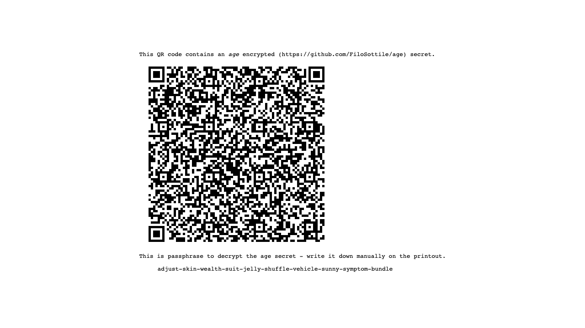
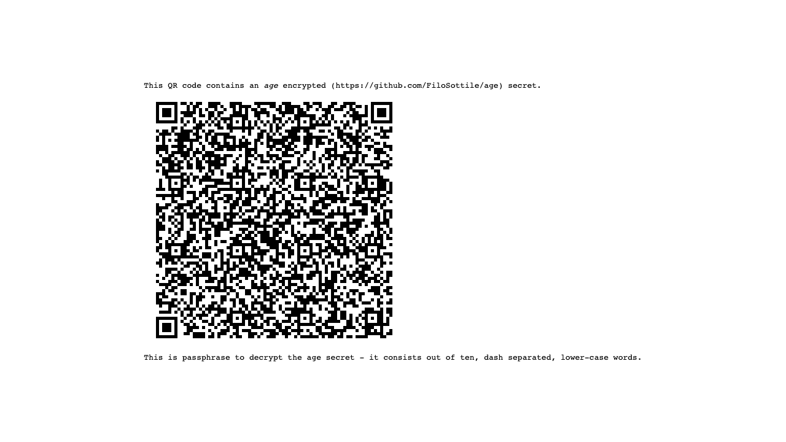
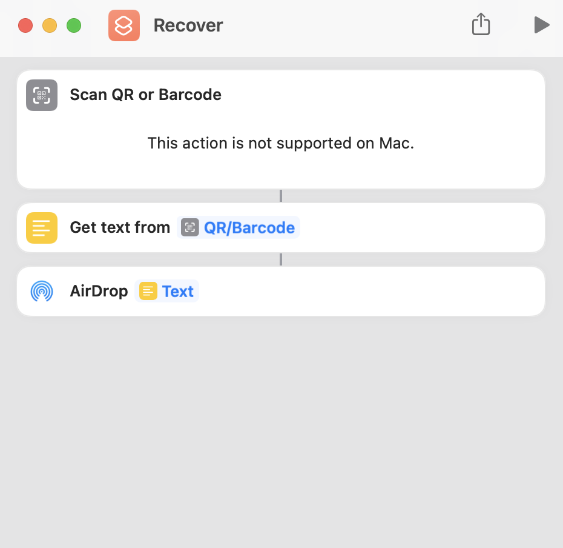

# Print age encrypted small secrets for offline recovery (`offkey`)

[](https://github.com/yawn/offkey/actions/workflows/go.yml)

`offkey` provides a workflow to render small sized secrets (e.g. secret keys) as encrypted QR codes, suitable for printing, subsequent long term storage and recovery using standard hardware (e.g. mobile phones).

The encryption part of `offkey` is handled through [age](https://github.com/FiloSottile/age) encryption and encoding.

## Creating a secret

`echo "this is my very secret message from 1658944996" | offkey`

This opens the standard browser and points it to `http://127.0.0.1:PORT/?token=TOKEN`. Both `PORT` and `TOKEN` parameter are randomized, with `PORT` matching any open TCP port.



The resulting page in the browser contains a randomly generated passphrase (following the conventions of `age`) e.g. `adjust-skin-wealth-suit-jelly-shuffle-vehicle-sunny-symptom-bundle`.

### Printing the secret

When printing this secret, CSS hides the passphrase and instead replaces it with hints on it's structure:



After printing, the passphrase needs to be written (with a permanent pen) on the printout. `offkey` exits automatically after serving the secret (or after 5 minutes when not serving the secret).

## Recovering a secret

There are various options for QR code scanning, e.g. using  using [zbar](https://formulae.brew.sh/formula/zbar) to extract the QR code content from a file, perhaps taken by [imagesnap](https://formulae.brew.sh/formula/imagesnap) (both on Mac).

Another alternative is to use an iOS workflow and an iOS devices to scan the QR code and send it's contents to a Mac using AirDrop:



The content of the QR code is an armored `age` file:

```
-----BEGIN AGE ENCRYPTED FILE-----
YWdlLWVuY3J5cHRpb24ub3JnL3YxCi0+IHNjcnlwdCBVU3dZa3MycTIxa2pkV3hP
WEplK0VnIDE4CmF1bndqS1BLTTJNT2hzRHNSelpJVFkxZkdCQjBvNk52RE10eGgz
aW4zeG8KLS0tIHB3YkZtUHFzdGJ4RUNscm1hcVBEdk03THd0WnI2M1d0YUtrQmF6
N1hVTUEKPdb2R2KULhdK+LgCcxC/ZahAVYqJsJG+N2MX7OGAXtfSTMw8ct8G/MKv
kz7ITT+um/g0gA5kegCH4ynQi171PXOXzZD2XrJ6mwNMzHOy8A==
-----END AGE ENCRYPTED FILE-----
```

This can be decrypted by just calling age e.g. `age --decrypt secret.age`. After entering the passphrase `adjust-skin-wealth-suit-jelly-shuffle-vehicle-sunny-symptom-bundle`, the secret is recovered:

```
age --decrypt secret.age 
Enter passphrase: 
this is my very secret message from 1658944996
```
